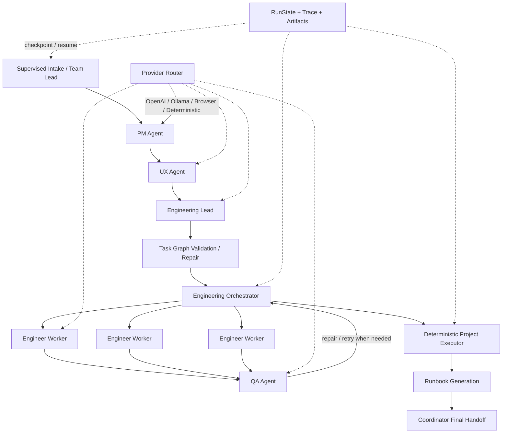

# Development System

A local, human-supervised multi-agent software development workflow that turns a project brief into an executable engineering plan, coordinated implementation tasks, QA-reviewed code, deterministic verification, and a final handoff.

The system is designed as an orchestration layer rather than a single coding agent. It separates product, UX, engineering planning, implementation, QA, workflow coordination, state management, and provider routing into distinct components so that each stage can be inspected, resumed, and validated independently.

## What it does

Given a project brief, the runner can:

- collect and refine requirements through a supervised intake UI;
- generate PM and UX specifications;
- create an engineering plan and dependency-aware task graph;
- validate and repair malformed task graphs before execution;
- distribute work across multiple engineer workers;
- run QA and targeted repair loops for failed work;
- write generated project files into an isolated workspace;
- run deterministic project-level checks after implementation;
- persist run state, artifacts, traces, and orchestrator state for recovery;
- automatically resume the most recent incomplete run;
- produce run instructions and a final coordinator handoff.

## Architecture



Human supervision and the Resources Desk are available across the workflow for approvals, missing resources, and blocked decisions.

## Engineering highlights

### Multi-provider routing

`model_provider_router.py` and `provider_config.py` route each workflow stage to an appropriate backend. Supported provider types include:

- OpenAI API;
- local Ollama models;
- an optional browser-backed web provider;
- deterministic Python-only execution.

Provider selection is stage-aware rather than global, allowing high-reasoning, implementation, compression, and deterministic tasks to use different execution paths.

### Stateful recovery

Each run receives a unique output directory and persists its execution state. `run_state.py` tracks the current workflow node, completed artifacts, blocks, task attempts, and resume position, while the engineering orchestrator persists its own queue state separately.

When the runner restarts, it can reuse completed stage artifacts and resume the most recent incomplete run instead of rebuilding the workflow from the beginning.

### Task-graph validation

Before engineer workers receive tasks, the Engineering Lead output is checked by `task_graph_validator.py`. Invalid dependency structures can be repaired automatically before orchestration begins.

### Engineer + QA loop

Engineering work is processed through multiple worker threads. Each task is staged, reviewed by QA, and either accepted, repaired, retried, blocked, or escalated through the workflow coordinator. Attempt limits and task state are persisted across restarts.

### Deterministic verification

After engineering completes, `project_executor.py` runs project-level deterministic checks. The final runbook and handoff are produced only after the engineering queue and executor gates have completed successfully.

### Context management and observability

The workflow includes optional local context compression, structured JSONL tracing, per-stage artifacts, and run-level logs. These mechanisms are intended to reduce redundant model context while preserving inspectable source artifacts and execution history.

## Repository structure

```text
.
├── operation.py                  # Main workflow runner
├── provider_config.py            # Run modes, stage registry, provider profiles
├── model_provider_router.py      # Provider dispatch and response handling
├── context_compressor.py         # Optional input-context compression
├── run_state.py                  # Run checkpoint and resume state
├── trace_utils.py                # Structured trace events
├── record.py                     # Run IDs, logs, and JSON artifacts
│
├── team_lead_agent.py            # Intake / requirements refinement
├── intake_agent.py               # Intake support
├── pm_agent.py                   # Product planning
├── ux_agent.py                   # UX planning
├── eng_lead_agent.py             # Engineering planning
├── eng_orchestrator_agent.py     # Task queue and engineering coordination
├── eng_agent.py                  # Engineer worker
├── qa_agent.py                   # QA and verification
├── coordinator_agent.py          # Workflow decisions and final handoff
│
├── task_graph_validator.py       # Dependency validation / repair
├── repo_context_compiler.py      # Task-specific repository context
├── local_file_writer.py          # Controlled workspace file writes
├── project_executor.py           # Deterministic project-level checks
├── resource_eval.py              # Resource request / resolution support
├── human_requests.py             # Human decision requests
├── supervise_ui.py               # Gradio supervision workspace
├── preflight.py                  # Environment and provider checks
├── gpt_web_collector.py          # Optional browser-backed provider helper
│
├── requirements.txt
└── docs/                         # Design and implementation notes
```

## Requirements

- Python 3.11 recommended
- macOS, Linux, or another environment capable of running the Python dependencies
- an OpenAI API key for OpenAI-backed stages
- optional Ollama installation for local context compression
- optional Chrome/Chromium + Playwright for the browser-backed development-mode provider

## Installation

Clone the repository and create a virtual environment:

```bash
git clone <your-repository-url>
cd Development-System-Public

python3 -m venv .venv
source .venv/bin/activate
pip install -r requirements.txt
```

If you plan to use the optional browser-backed provider, also install the Playwright browser runtime:

```bash
python -m playwright install chromium
```

## Quick start

The simplest configuration is **Power Mode**, which uses OpenAI for substantive AI stages and keeps deterministic stages local.

Set your API key as an environment variable:

```bash
export OPENAI_API_KEY="your-key-here"
export ASCENDANT_RUN_MODE=power
```

Then start the workflow:

```bash
python operation.py
```

The runner performs preflight checks and launches the local supervision workspace. The default UI port is `7860` unless overridden.

> Do not commit API keys to the repository. Environment variables are the recommended configuration method.

## Starting a new project

You can start with no `initial_input.json`; the Team Lead intake UI will collect the project requirements interactively.

Alternatively, provide an `initial_input.json` as a seed. A minimal example is:

```json
{
  "brief": "Build a small local web application that analyzes a CSV file and presents summary statistics.",
  "meta": {
    "product_goal": "Create a working local MVP",
    "constraints": [
      "local execution only",
      "minimal dependencies"
    ]
  }
}
```

The intake stage still allows the brief to be reviewed and refined before the downstream workflow begins.

## Run modes

The system currently supports two run modes.

| Mode | Intended use | Routing behavior |
|---|---|---|
| `power` | Simplest full workflow | OpenAI for substantive AI stages; deterministic stages remain local; Ollama can be used for context compression |
| `development` | Mixed-provider development workflow | OpenAI for implementation-heavy stages, optional browser-backed provider for selected management stages, Ollama for context compression |

Select a mode with:

```bash
export ASCENDANT_RUN_MODE=power
```

or:

```bash
export ASCENDANT_RUN_MODE=development
```

Development Mode requires the browser-backed provider configuration described in [`docs/PROVIDER_ROUTING_NOTES.md`](docs/PROVIDER_ROUTING_NOTES.md).

## Useful configuration

```bash
# Start a fresh run instead of resuming the newest incomplete one
export FORCE_NEW_RUN=1

# Number of engineer worker threads
export NUM_ENGINEERS=3

# Maximum attempts allowed for an engineering task
export MAX_ATTEMPTS_PER_TASK=3

# Local supervision UI port
export WORKSPACE_UI_PORT=7860

# Turn strict preflight warnings into failures
export ASCENDANT_PREFLIGHT_STRICT=1

# Optional local Ollama endpoint
export OLLAMA_HOST=http://localhost:11434

# Disable context compression if desired
export CONTEXT_COMPRESSOR_ENABLED=0
```

Provider- and model-specific overrides are defined in `provider_config.py`.

## Preflight checks

You can run the deterministic environment checks separately:

```bash
export ASCENDANT_RUN_MODE=power
python preflight.py --output-dir preflight_output
```

Preflight checks provider configuration, required credentials, optional local services, JSON input validity, and output-directory writability.

## Run outputs

Each workflow run creates a unique directory under:

```text
outputs/<run_id>/
```

Depending on the run, artifacts can include:

```text
initial_input.json
pm_output.json
ux_output.json
eng_lead_output.json
task_graph_validation.json
orchestrator_state.json
run_state.json
trace.jsonl
workspace/
executor_report.json
executor/EXECUTOR_REPORT.md
RUN_INSTRUCTIONS.md
run_instructions.json
```

Engineering attempts, QA outputs, retry context, repair packets, resource requests, and orchestrator submissions are stored in run-specific subdirectories for auditability and resume support.

General run logs are written under `logs/`.

## Resume behavior

By default, `operation.py` looks for the most recent incomplete run and resumes it. Completed stage artifacts are reused, while unfinished work continues from persisted run and orchestrator state.

To force a clean run:

```bash
FORCE_NEW_RUN=1 python operation.py
```

## Documentation

Additional implementation notes are available in `docs/`:

- [`PROVIDER_ROUTING_NOTES.md`](docs/PROVIDER_ROUTING_NOTES.md) — provider profiles and run-mode routing
- [`RUN_STATE_NOTES.md`](docs/RUN_STATE_NOTES.md) — checkpoint and resume design
- [`CONTEXT_COMPRESSOR_NOTES.md`](docs/CONTEXT_COMPRESSOR_NOTES.md) — local context preprocessing
- [`TRACE_OBSERVABILITY_NOTES.md`](docs/TRACE_OBSERVABILITY_NOTES.md) — tracing and observability
- [`LOCAL_FILE_WRITER_NOTES.md`](docs/LOCAL_FILE_WRITER_NOTES.md) — workspace file-writing behavior
- [`COORDINATOR_WORKFLOW_DECISION_NOTES.md`](docs/COORDINATOR_WORKFLOW_DECISION_NOTES.md) — workflow-decision handling
- [`PROMPT_CACHING_NOTES.md`](docs/PROMPT_CACHING_NOTES.md) — prompt-cache behavior

## Security and local-data notes

- Keep API keys in environment variables; do not commit them.
- Keep `.env`, `openai_api_key`, browser profiles, logs, generated outputs, and local virtual environments out of version control.
- Browser-backed execution is intended to automate a normal, already-authorized webpage session. It is not designed to bypass login controls, CAPTCHA, 2FA, paywalls, rate limits, or anti-bot protections.
- Generated run artifacts may contain prompts, code, resource content, or debugging information. Review them before sharing publicly.

## Project status

This repository is an experimental local orchestration framework and development prototype. It emphasizes explicit workflow stages, inspectable state, recovery, human supervision, and deterministic gates rather than production deployment or hosted multi-user operation.
